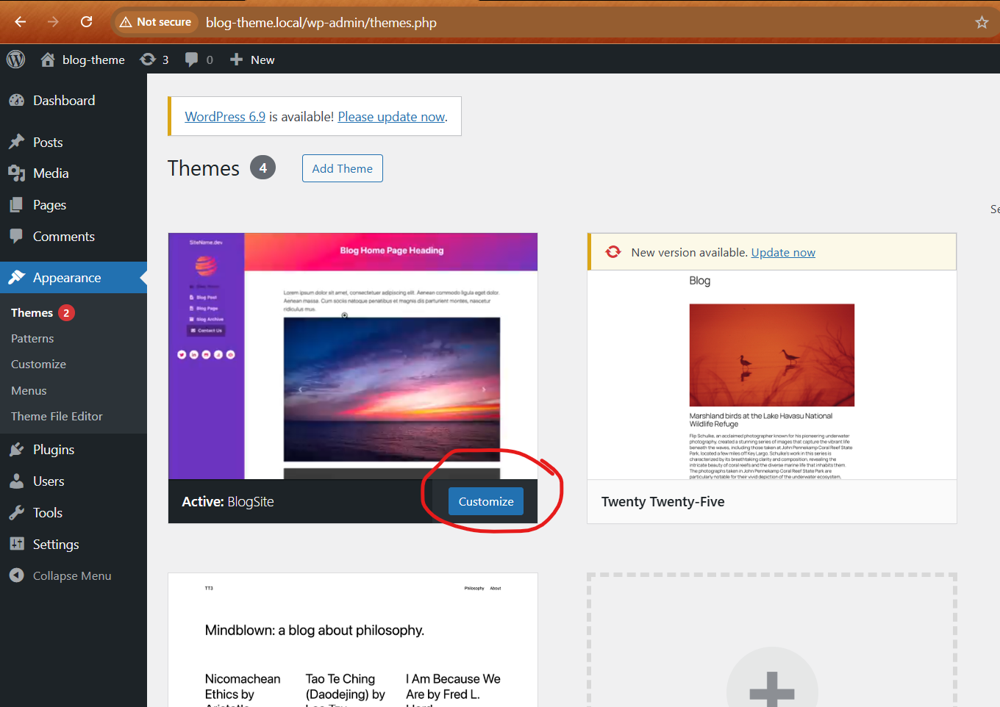
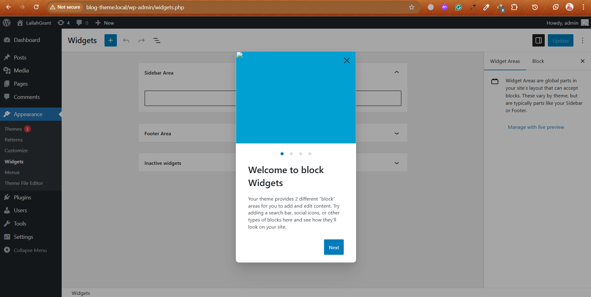
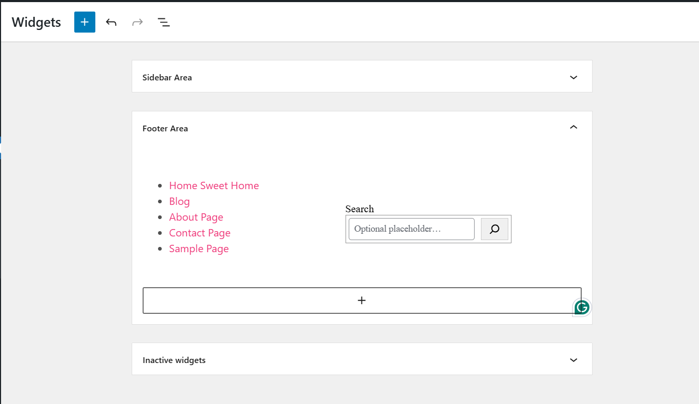

### How to create a Custom WordPress Theme

> Custom WordPress theme takes all the various sections and splits them apart into individual parts;
> - Creates components from the template.
> - Creates many seperate pieces i.e. one with the header, one with the sidebar, one with the navbar, one with the footer and WordPress puts them into one single file.


#### Set up WordPress
- Local by FlyWheel

> There are **two** required files for the WordPress theme:
> - `style.css` file
> - `index.php` file

#### Add the HTML, CSS and JS code (frontend template) to the `wp-content` folder

> Set up the folders below in the `wp-content` directory:- 
> - assets>css; assets>js; assets>fonts; assets>images
> - classes
> - inc
> - templates
> - template-parts

### Why we set up the WordPress folders (directories) and files in that folder:-

- Add `assests` folder
    - Add `css`, `js`, `fonts`, `images`, in `assests`  folder in the root folder.
    - Add `classes` folder to the root for the `php` functions
    - Add `inc` folder to the root for `include` files
    - Add `template-parts` folder to the root for splitting individual parts of the template even further.
    - Add `templates` folder to the root.

### Add the following files for reasons below:
- `404.php` - file served for a 404 error
- `archive.php` - responsible for delivering an archive of blog posts; the index of all blog posts in a hierarchical format.
- `comments.php` - responsible for displaying and serving up comments.
- `footer.php` - responsible for footer navigation.
- `functions.php` - Special file in WordPress where we can; `override` and `initiate` different of the theme inside WordPress. It has `raw php code`.
- `header.php` - file responsible for the header section.
- `index.php` - it is a *required file*; It is a **fallback** file if the file can't be found in the template.
- `page.php` - file responsiple for displaying static pages that are not blogs like about page.
- `readme.txt` - can put **copyright** notices.
- `search.php` - will display search results
- `single.php` - file responsible for displaying a single blog post.
- `style.css` - it is a *required file*; master stylesheet for the website.
- `front-page.php` - static home page or front page.

### Add a screenshot
- Add an image named `screenshot.png` that will be a preview of the theme.

> Refer to the WordPress `codex`
> [WordPress Codex - Theme Development ](codexhttps://codex.wordpress.org/Theme_Development)


### `style.css` file with mandatory *metadata*

```css
/* 
Theme Name: BlogSite
Text Domain: BlogSite
Version: 1.0
Description: Fancy left sidebar theme
Tags: left-sidebar, responsive, fancy
Author: Lailah Grant
Author URI: https://www.lailah-portfolio.canva/portfolio
*/
```
- Add css styles

### Link CSS files
- Use `enqueue` to  know which file to load faster
- Add code in the `functions.php`
- **Dynamically** load css file

```php

<?php

function blogsite_register_styles(){
    wp_enqueue_style('blogsite-style', get_template_directory_uri() . "/style.css", array(), '1.0', 'all');
    wp_enqueue_style('blogsite-bootstrap', "https://stackpath.bootstrapcdn.com/bootstrap/4.4.1/css/bootstrap.min.css", array(), '1.0', 'all');
    wp_enqueue_style('blogsite-fontawesome', "https://cdnjs.cloudflare.com/ajax/libs/font-awesome/5.13.0/css/all.min.css", array(), '1.0', 'all');
}

add_action('wp_enqueue_scripts', 'blogsite_register_styles');

?>
```

- To load in hirarchical order i.e bootstrap before all other css do the following;
-[x] Pass the `blogsite-bootstrap` method in the `array()` as `wp_enqueue_style('blogsite-style', get_template_directory_uri() . "/style.css", array('blogsite-bootstrap'), '1.0', 'all');`


```php

<?php

//make dynamic stylesheets
function blogsite_register_styles(){

    //make version of the theme dynamic
    $version = wp_get_theme() -> get('Version'); //version from the style.css

    wp_enqueue_style('blogsite-style', get_template_directory_uri() . "/style.css", array('blogsite-bootstrap'), '1.0', 'all');
    wp_enqueue_style('blogsite-bootstrap', "https://stackpath.bootstrapcdn.com/bootstrap/4.4.1/css/bootstrap.min.css", array(), '4.4.1', 'all');
    wp_enqueue_style('blogsite-fontawesome', "https://cdnjs.cloudflare.com/ajax/libs/font-awesome/5.13.0/css/all.min.css", array(), '5.13.0', 'all');
}

add_action('wp_enqueue_scripts', 'blogsite_register_styles');


//make dynamic javascript scripts
function blogsite_register_scripts(){

    wp_enqueue_script('blogsite-jquery', 'https://code.jquery.com/jquery-3.4.1.slim.min.js', array(), '3.4.1', true); //true to appear in the footer
    wp_enqueue_script('blogsite-popper', 'https://cdn.jsdelivr.net/npm/popper.js@1.16.0/dist/umd/popper.min.js', array(), '1.16.0', true);
    wp_enqueue_script('blogsite-bootstrap', 'https://stackpath.bootstrapcdn.com/bootstrap/4.4.1/js/bootstrap.min.js', array(), '4.4.1', true);
    wp_enqueue_script('blogsite-js', get_template_directory_uri()."/assets/js/main.js", array(), '1.0', true);
}

add_action('wp_enqueue_scripts', 'blogsite_register_scripts');

?>
```

### Split code into footer and header
- Add html to the `header.php` and `footer.php`

> header.php

```html
<!DOCTYPE html>
<html lang="en"> 
<head>
    <!-- <title>Blog Site Template</title> -->
    <!-- Meta -->
    <meta charset="utf-8">
    <meta http-equiv="X-UA-Compatible" content="IE=edge">
    <meta name="viewport" content="width=device-width, initial-scale=1.0">
    <meta name="description" content="Blog Site Template">
    <meta name="author" content="https://youtube.com/FollowAndrew">    
    <link rel="shortcut icon" href="images/logo.png"> 
    
    <!-- FontAwesome CSS-->
	<!-- <link rel="stylesheet" href="https://cdnjs.cloudflare.com/ajax/libs/font-awesome/5.13.0/css/all.min.css"> -->
	<!-- Bootstrap CSS-->
	<!-- <link rel="stylesheet" href="https://stackpath.bootstrapcdn.com/bootstrap/4.4.1/css/bootstrap.min.css" integrity="sha384-Vkoo8x4CGsO3+Hhxv8T/Q5PaXtkKtu6ug5TOeNV6gBiFeWPGFN9MuhOf23Q9Ifjh" crossorigin="anonymous">   -->
	<!-- Theme CSS -->
	<!-- <link rel="stylesheet" href="css/style.css"> -->
	 <?php
		wp_head();
	 ?>

</head> 

<body>
    
    <header class="header text-center">	    
	    <a class="site-title pt-lg-4 mb-0" href="index.html">SiteName.dev</a>
        
	    <nav class="navbar navbar-expand-lg navbar-dark" >
           
			<button class="navbar-toggler" type="button" data-toggle="collapse" data-target="#navigation" aria-controls="navigation" aria-expanded="false" aria-label="Toggle navigation">
			<span class="navbar-toggler-icon"></span>
			</button>

			<div id="navigation" class="collapse navbar-collapse flex-column" >
							
				
				<ul class="navbar-nav flex-column text-sm-center text-md-left">
					<li class="nav-item active">
					    <a class="nav-link" href="index.html"><i class="fas fa-home fa-fw mr-2"></i>Blog Home <span class="sr-only">(current)</span></a>
					</li>
					<li class="nav-item">
					    <a class="nav-link" href="post.html"><i class="fas fa-file-alt fa-fw mr-2"></i>Blog Post</a>
					</li>
					<li class="nav-item">
					    <a class="nav-link" href="page.html"><i class="fas fa-file-image fa-fw mr-2"></i>Blog Page</a>
					</li>
					<li class="nav-item">
					    <a class="nav-link" href="archive.html"><i class="fas fa-archive fa-fw mr-2"></i>Blog Archive</a>
					</li>
					<li class="nav-item">
					    <a class="nav-link btn btn-primary" href="contact.html"><i class="fas fa-envelope fa-fw mr-2"></i>Contact Us</a>
					</li>
				</ul>
				<hr>
				<ul class="social-list list-inline py-3 mx-auto">
					<li class="list-inline-item"><a href="#"><i class="fab fa-twitter fa-fw"></i></a></li>
					<li class="list-inline-item"><a href="#"><i class="fab fa-linkedin-in fa-fw"></i></a></li>
					<li class="list-inline-item"><a href="#"><i class="fab fa-github-alt fa-fw"></i></a></li>
					<li class="list-inline-item"><a href="#"><i class="fab fa-stack-overflow fa-fw"></i></a></li>
					<li class="list-inline-item"><a href="#"><i class="fab fa-codepen fa-fw"></i></a></li>
				</ul>

			</div>
		</nav>
    </header>
```

> footer.php

``` html
<!-- Bootstrap Javascript -->
	 
	<?php
		wp_footer();
	?>
	
</body>
</html> 
```

### Adding a Dynamic Website Title.
> Add dynamic title tag support
>Remove the `<title>` from the `front-page.php`
- Add the following into `functions.php`

```php
function blogsite_theme_support(){
    // Add Dynamic Website Title Name - adds dynamic title tag support
    add_theme_support('title-tag');

}
add_action('after_setup_theme', 'blogsite_theme_support');
```

### WordPress Loop

> How we can tell WordPress to query the database, pull out all the content for a specific page and insert it dynamically into the section of content on the website.

- Anything in Posts & Pages in WordPress is saved as a row in the database.

> front-page.php

```php
<?php
 get_header();
?>
    
    
		<article class="content px-3 py-5 p-md-5">
	    
		<?php
			if(have_posts()){
				while(have_posts()){
					the_post();
					the_content();
				}
			}
	
		?> 

	    </article>
	    
<?php

get_footer();

?>
```

> header.php

```html
<div class="main-wrapper">
	<header class="page-title theme-bg-light text-center gradient py-5">
		<h1 class="heading"><?php the_title(); ?> </h1>
	</header>
```

### WordPress Menus

- Set up menu locations
- Create a `key-value` pair **array** 
- WordPress Menus - creates **Menus** tab in the *Appearance* navigation in the **wp-admin backend dashboard**.

> functions.php

```php
<?php
//WordPress Menus - creates Menus tab in the Appearance navigation in the wp-admin
function blogsite_menus(){
    //set up menu locations
    //key-value pair arrays
    $locations = array(
        'primary' => "Desktop Primary Left Sidebar",
        'footer' => "Footer Menu Items"
    );

    register_nav_menus($locations);    

}
//add another hook
add_action('init', 'blogsite_menus');
?>
```

- The above *WordPress Menus* creates the following in the **wp-admin backend dashboard**.


- Loop through the **header.php** in the navigation area for dynamic navigation.
	- Use `wp_nav_menu()` - it takes an **`array`** of several parameters.

```php
<?php
	wp_nav_menu(
		array(
			'menu' => 'primary',
			'container' => '',
			'theme_location' => 'primary',
			'items_wrap' => '<ul></ul>'
			)
		);

?>
```

- In the Wordpress admin;
 - [x] check `CSS Classes`


- These classes `nav-link` are added to the `ul` and **NOT** the `a` tags in the `CSS Classes` on the wp-admin.


### Custom logo  
- Upload image in the backend and display it dynamically.
- Add a `theme support` for this function
- Adds `select logo` to the **Customize** theme | site identity 




> functions.php

```php
function blogsite_theme_support(){
       //add a logo
    add_theme_support('custom-logo'); //adds logo

}
add_action('after_setup_theme', 'blogsite_theme_support');
```

> -In the header.php

```php
<div id="navigation" class="collapse navbar-collapse flex-column" >
	<?php
		if(function_exists('the_custom_logo')){
			$custom_logo_id = get_theme_mod('custom_logo');
			$logo = wp_get_attachment_image_src($custom_logo_id);
			// print_r($logo);
			}
		?>
" alt="logo" >	
```

### Dynamic Site name
- In the `header.php`
```html
<header class="header text-center">	    
	<a class="site-title pt-lg-4 mb-0" href="index.html">
		<?php echo get_bloginfo('name'); ?>
	</a>
```

### Add Posts Dynamically

- In the `functions.php`

```php
function blogsite_theme_support(){
    //add "Set featured image" feature on "Add New Post"
    add_theme_support('post-thumbnails');

}
add_action('after_setup_theme', 'blogsite_theme_support');
```
- In WordPress Admin, `Add New` Post, `Set featured image`
- Create custom post theme in `single.php`
 - Copy code from `front-page.php` into `single.php`
- Have many parts in a post template - add templates in the `template-parts` folder.
- Add this `get_template_part('template-parts/content', 'article');` into `single.php`
- Create `content-article.php` in the `template-parts` folder.

> single.php

```php
<?php
 get_header();
?>
    
    
		<article class="content px-3 py-5 p-md-5">
	    
		<?php
			if(have_posts()){
				while(have_posts()){
					the_post();
					get_template_part('template-parts/content', 'article');
				}
			}
	
		?> 

	    </article>
	    
    
<?php

get_footer();

?>
```

- Add the following in the `content-article.php` file

```php
<?php
the_content();

?>
```

> To make gallery content
> create a `content-gallery.php` file
> Call the file of gallery as follows:
> `get_template_part('template-parts/content', 'gallery');`

- Add the following in the `content-article.php` file

- Add comments in the `content-article.php` file

```php
//ADD COMMENTS
<?php
    comments_template();
?>
```

> In the `comments.php` file
- Add thid to get the number of comments if any

```php
<?php
    if(!have_comments()){
        echo "Leave a Comment";
    }else{
        echo get_comments_number(). " Comments";
    }
?>
```

- Output individual comments in the `comments.php`
	-  `wp_list_comments();` takes a lot of *arguments*.

```php
<div class="comments-inner">

	<?php
        wp_list_comments(
            array(
                'avatar_size' => 120,
                'style' => 'div',
            ) 
        );
    ?>

</div><!-- .comments-inner -->

</div><!-- comments -->

<hr class="" aria-hidden="true">
					
<?php
    if(comments_open()){
        comment_form(
            array(
                'class_form' => '',
                'title_reply_before' => '<h2 id="reply-title" class="comment-reply-title">',
                'title_reply_after' => '</h2>'
            )
            );
    }
?>

</div>
```

#### Custom Walkers - refer to the WordPress Codex


### Add archive

- Add the following in `archive.php`

```php
<?php
 get_header();
?>
    
    
		<article class="content px-3 py-5 p-md-5">
	    
		<?php
			if(have_posts()){
				while(have_posts()){
					the_post();
					get_template_part('template-parts/content', 'archive');
				}
			}
	
		?> 

	    </article>
	    
    
<?php

get_footer();

?>
```

- Create `content-archive.php` in the 	`template-parts` folder
- Add the follwoing in the `content-archive.php`

```php
<div class="container">

<?php
the_content();
?>

</div>
```

- Link archives by;
	- Create a `blog` page in the dashboard
	- Go to `Settings` on the dashboard, `Reading`, Select `Blog` page in the `Posts page` menu and save changes.


- Add the code in `archive.php` into `index.php` to be the fallback content.
	- `index.php`

```php
<?php
 get_header();
?>

	<article class="content px-3 py-5 p-md-5">
	    
	<?php
		if(have_posts()){
			while(have_posts()){
				the_post();
				get_template_part('template-parts/content', 'archive');
			}
		}
	
	?> 

	</article>
	
<?php
get_footer();
?>
```

- Edit the `content-archive.php` as follows;

```php
<div class="container">

<?php
the_excerpt();
?>

</div>
```

#### Display posts dynamically
- Create posts in the dashboard manually
- Add dynamic code in the `content-archive.php` file to display all the posts.
	- Display the `Featured Image` dynamically
	a) `the_post_thumbnail()`  - gives full size of the image
	OR
	b) `the_post_thumbnail_url()` - resizes image to thumbnail size from the `Media` Settings in the dashboard

```php
<div class="container">

<div class="container">
    <div class="post mb-5">
	    <div class="media">
		    " alt="image">
		    <div class="media-body">
			    <h3 class="title mb-1"><?php the_title(); ?><a href="single.php"></a></h3>
			    <div class="meta mb-1"><span class="date">Published <?php the_date(); ?> ago</span><span class="comment"><a href="#"><?php comments_number(); ?> comments</a></span></div>
			    <div class="intro">
                    <?php
                    the_excerpt();
                    ?>
                </div>
			    <a class="more-link" href="<?php the_permalink(); ?>">Read more &rarr;</a>
		    </div><!--//media-body-->
	    </div><!--//media-->
    </div>

</div>
```

### Add Pagination links
- Settings, Readings, set to `4` Blog pages show at most & Syndi...
- Edit in the `index.php` file with;

```php
<?php
	the_posts_pagination();
?>
```

- `index.php`

```php
<?php
 get_header();
?>
    
    
<article class="content px-3 py-5 p-md-5">
	    
<?php
	if(have_posts()){
		while(have_posts()){
			the_post();
			get_template_part('template-parts/content', 'archive');
		}
	}
	
?> 

</article>
	    
<?php 
the_posts_pagination(); 
?>
    
<?php

get_footer();

?>
```


### Create Content for pages
> Creates content into the Contact, About pages
- Create new file `content-page.php` in the `templates-parts` directory.

`content-page.php`

```php
<div class="container">

<?php
the_content();
?>

</div>
```

- Add code from `single.php` into `page.php`

`page.php`

```php
<?php
 get_header();
?>
    
    
		<article class="content px-3 py-5 p-md-5">
	    
		<?php
			if(have_posts()){
				while(have_posts()){
					the_post();
					get_template_part('template-parts/content', 'page');
				}
			}
	
		?> 

	    </article>
	    
    
<?php

get_footer();

?>
```


### Add WIDGETS
- For extra customization by the user
- Add widgets 
- Add feature in the `functions.php` as follows;

```php
//Custom Widgets
function blogsite_widget_areas(){
    register_sidebar(
        array(
            'before_title' => '',
            'after_title' => '',
            'before_widget' => '<div class="widget-item">',
            'after_widget' => '</div>',
            'name' => 'Sidebar Area',
            'id' => 'sidebar-1',
            'description' => 'Sidebar Widget Area'
        )
    );

    register_sidebar(
        array(
            'before_title' => '<h2 class="widget-title">',
            'after_title' => '</h2>',
            'before_widget' => '<div class="footer-widget-item">',
            'after_widget' => '</div>',
            'name' => 'Footer Area',
            'id' => 'footer-1',
            'description' => 'Footer Widget Area'
        )
    );
}

add_action('widgets_init', 'blogsite_widget_areas');

```

- The above code creates new widgets `Sidebar Area` | `Footer Area` in the `Appearance`, `Widgets`, in the dashboard.



- Output the sidebar on the page dynamically in the `header.php` as follows;

```php
<!-- Add sidebar widget dynamically -->
					<?php
						dynamic_sidebar('sidebar-1');
					?>
```

> To make the navbar editable by the user on the dashboard
> - Cut and paste the header into the `sidebar widget` in the dashboard in the sidebar widget.
> - User can remove or add links they want.

`Footer Area`
-  Add `<?php dynamic_sidebar('sidebar-1'); ?>` into the `footer.php` to add dynamic widgets.


### Page Not Found - 404 page
- Copy content from `index.php` file into `404.php` and edit as follows;
- Add search form for posts

```php
<?php
 get_header();
?>
    
    
<article class="content px-3 py-5 p-md-5">
	  
<h1>Page Not Found</p>

<?php
get_search_form();
?>

</article>

<?php

get_footer();

?>
    
```

#### Search page


- Add code from `archive.php` into `search.php` as follows

```php
<?php
 get_header();
?>
    
    
		<article class="content px-3 py-5 p-md-5">
	    
		<?php
			if(have_posts()){
				while(have_posts()){
					the_post();
					get_template_part('template-parts/content', 'archive');
				}
			}
	
		?> 

	    </article>
	    
    
<?php

get_footer();

?>
    
```

- Add `Search` in the Footer widgets



<hr>

## To Study

- [x] Custom Post Types
- [x] Custom Fields 


